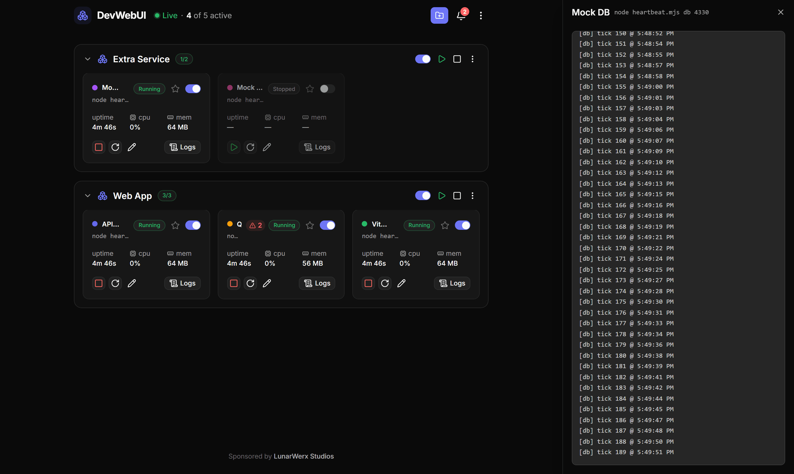
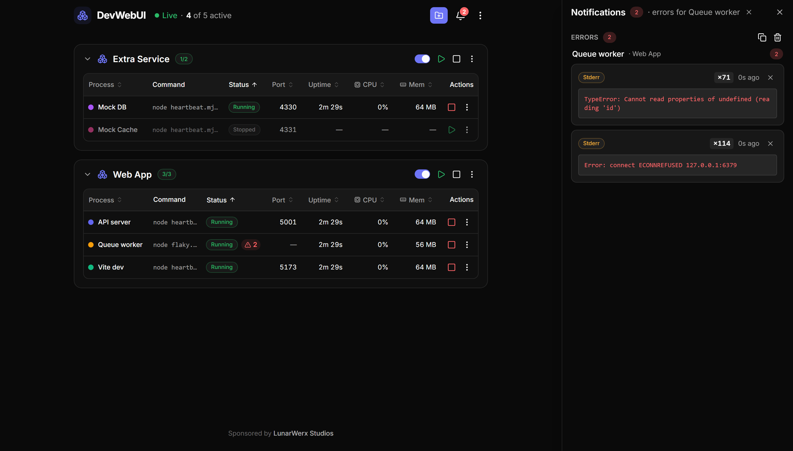

<div align="center">

<picture>
  <source media="(prefers-color-scheme: dark)" srcset="web/public/logo-dark.svg" />
  
</picture>

### A GUI **+ MCP** control plane for your local dev servers

Run every dev server from one pane: click to start, stop and restart, and watch live status, CPU,
memory and logs. Then let your AI agents drive the **same** daemon over MCP.<br/>
No more `bun run dev` babysitting across a dozen terminal tabs.

[**Upstream website**](https://devwebui.github.io) · [Quick start](#quick-start) · [`.devwebui` files](#devwebui-files) · [MCP](#drive-it-from-an-ai-agent-mcp) · [Changelog](CHANGELOG.md)

[](https://github.com/FelixJI/DevWebUI/releases)
[](https://github.com/LunarWerxs/devwebui/actions/workflows/ci.yml)
[](LICENSE)
[](https://discord.gg/PsWpeNUzhk)

<br/>


</div>

DevWebUI is a GUI and MCP control plane for local dev servers that lets developers start, stop,
restart, and monitor every dev process in a project from one dashboard, and lets AI coding agents
drive the same daemon over MCP, replacing a dozen terminal tabs of manual `bun run dev` babysitting.

## Why it exists

The good local-dev GUIs (hotel, exo) are abandoned. PM2's web UI is paid. Everything else that's
still maintained is a TUI or a heavy container/k8s tool. Nobody ships the one thing you actually
want for a fleet of dev servers: **a GUI and MCP over one daemon**, so you click, your agents
automate, and everyone works off a single source of truth.

## How it compares

- **vs. hotel and exo**: both are local dev-server GUIs, but neither has shipped a release in a
  while. DevWebUI is actively maintained and pairs its GUI with an MCP server, which neither offers.
- **vs. PM2's web UI (PM2 Plus / PM2.io)**: PM2 itself is free from the CLI, but its hosted
  monitoring dashboard is a paid product beyond a limited free tier. DevWebUI's GUI is free and
  runs entirely on your machine, no account needed for core functionality.
- **vs. Docker Compose / devcontainers**: these give you full container isolation, which is more
  infrastructure than most local dev-server juggling needs. DevWebUI runs your existing commands
  (`npm run dev`, `bun run dev`, etc.) directly, no containers or config rewrite required.

## Quick start

**Prebuilt Windows app**: download `devwebui-windows-x64.exe` from
[Releases](https://github.com/FelixJI/DevWebUI/releases) and run it directly. It is an
icon-bearing GUI executable with the dashboard embedded and no console window or sidecar folders.
The plain ZIP beside it is reserved for automatic updates. To adopt only releases that have been
public for a while, set **Settings -> App updates -> Update cooldown** to a number of days: a
release younger than that is neither offered nor installed, so a bad release has time to be caught
and pulled first (0, the default, offers the newest release at once).

The tray icon comes with both downloads. It comes from a small separate launcher
(`misc\lunarwerx-tray.exe`); the zip ships it beside the exe, and since 0.8.8 the single-file
`devwebui.exe` carries it inside the binary and writes it out beside its own state on first run, so
either download gets you the icon, Quit and the auto-restart supervisor. (Before 0.8.8 the bare exe
had none, and this line said so as though it were a decision.) `misc\Create-Shortcut.ps1` still
makes a shortcut that launches through the tray host directly.

**Windows source checkout**: double-click the **`DevWebUI`** shortcut. It runs hidden with a tray
icon: right-click for **Open / Rebuild & Restart / Restart / Stop all processes / Quit**
(**Stop all processes** halts every dev server and leaves DevWebUI running). The first launch builds once;
after that it's instant. Changed the GUI? Hit **Rebuild & Restart**.

**Any OS**: from a terminal:

```bash
bun install
bun run dev      # daemon on :4000  +  GUI on http://localhost:4010
```

On its first launch DevWebUI shows an empty dashboard: **it never scans your disks** (see
[Local-first](#local-first)). Use **Add project**, drop a folder or `.devwebui` file onto the
Windows launcher, or run `devwebui open <path>` whenever you want to register something new —
those read only the folder you point at. Want a dependency-free sample?
Add `server/examples/extra.devwebui`. The GUI and API share one port (default `4000`); if it's
taken, the daemon hops to the next free one and opens the URL it actually bound.

## What you get

- **One-click control**: start / stop / restart any dev server; live status, CPU, memory, logs.
- **One panel per repo**: a `.devwebui` file groups every process under one collapsible header; your projects auto-reload next launch.
- **Runtime-aware launches**: automatic mode follows each project's lockfile, and compatible Bun/Node commands launch without a permanent shell wrapper.
- **Port-conflict rescue**: detects a taken port, tells you which process is holding it, and frees it on request.
- **One origin for every server**: open any managed process through DevWebUI's own port at `http://<target>.localhost:4000` (or `/proxy/<target>/`), where `<target>` is a process id like `p1a2b3c4.web`, a project name like `my-app`, or a declared port; HTTP and WebSocket (HMR) are relayed, only to ports a registered process declares, behind the same cross-site guard as the API.
- **Persistent error log**: de-duplicated stderr / crashes / error-looking stdout that survives restarts. Every `file:line:col` in it is a link that opens that line in the editor you already have running (VS Code and its forks, JetBrains IDEs, Zed, Sublime Text, Notepad++); set `DEVWEBUI_EDITOR` to the editor's executable to pick one explicitly.
- **Desktop shortcuts (Windows)**: send any server (or a whole repo) to your Desktop from the ⋮ menu; double-click starts it, linked servers and all, in a small window with a Stop button.
- **Built for agents**: a full set of MCP tools drives the same daemon you click, off one shared state.
- **Localized & themed**: full i18n — English, 简体中文, 繁體中文, 日本語, Español, Deutsch,
  Français ([add a language](web/src/i18n/README.md)); light/dark that follows your OS by default.
- **Lives in your tray**: a Windows tray app runs the daemon hidden; Open / Rebuild / Restart / Quit.

<table>
  <tr>
    <td width="50%" valign="top">
      <b>Live logs, streamed</b><br/>
      Tail any process without leaving the pane.<br/><br/>
      
    </td>
    <td width="50%" valign="top">
      <b>De-duplicated error log</b><br/>
      Repeats collapse into one entry with a count, and it survives restarts.<br/><br/>
      
    </td>
  </tr>
</table>

<p align="center"><sub>Follows your OS light/dark setting by default; light and dark themes both ship.</sub></p>
<p align="center"></p>

## `.devwebui` files

One small file per repo lists the servers to run. Drop it in the repo root and click **Add project**:

```jsonc
{
  "name": "Connections",
  "processes": [
    { "id": "main", "name": "Main SPA",  "command": "bun run dev:main", "autostart": true },
    { "id": "pay",  "name": "Pay plane", "command": "bun run dev:pay",   "port": 4020 }
  ]
}
```

Per-process: `id`, `name`, `command`, plus optional `cwd`, `port`, `url`, `color`, `env`,
`autostart`, `waitForPort`, `links`, `companion`, `compose`, `answers`. You can also add and edit
processes right in the GUI, and DevWebUI writes them back to the file. `links` groups servers that
run as one unit (starting or stopping one starts or stops them all); `companion` marks a process,
like a shared database, that starts alongside any other process in the project you start by hand.
A `compose` block brings the repo's `docker compose` stack up first, waits for its ports, and
injects `DATABASE_URL`/`REDIS_URL`-style env derived from each service's image. `answers` lists expect/send rules that type a reply into stdin when a program that reads it without
a TTY check (a shell `read`, `set /p`, Python `input()`, a custom setup script) stops at a prompt,
so it does not wait forever with no terminal to type into.

**Full field spec + a copy-paste prompt that writes the file for you →** [`AI_GUIDE.md`](AI_GUIDE.md)

## Drive it from an AI agent (MCP)

The MCP server is a thin stdio client over the running daemon, so the GUI and your agents share one
state. Start the daemon, then register:

```jsonc
{
  "mcpServers": {
    "devwebui": {
      "command": "bun",
      "args": ["server/src/mcp.ts"],
      "cwd": "/absolute/path/to/devwebui",
      "env": { "DEVWEBUI_URL": "http://localhost:4000" }
    }
  }
}
```

43 tools cover projects, processes (start/stop/restart, enable/disable, all), logs, the error
log (with jump-to-source via `open_in_editor`), threshold alerts, and the live browser tabs of your dev apps: an opt-in `<script>` snippet lets
an agent read a page's client-side errors and call inspection tools the app registers on the page. **Full list →** [`AI_GUIDE.md`](AI_GUIDE.md#for-an-ai-driving-devwebui-over-mcp)

## CLI

```bash
devwebui start | stop | status | list                 # boot / stop the daemon, inspect state
devwebui start-process | stop-process | restart-process <id|name>
devwebui start-all | stop-all
devwebui alerts list | add | remove | events | clear  # threshold alert rules + fired-event history
devwebui open <folder|file.devwebui>                  # add/drop a project; starts it if already added
devwebui pairing codes | clients | revoke <id>        # local API auth: pairing codes + paired browsers
devwebui mcp                                           # the stdio MCP server for agents
```

A thin client over the same REST API the GUI and MCP use. Run `devwebui --help` for the rest;
`DEVWEBUI_URL` / `DEVWEBUI_PORT` point it at another daemon.

### Locking the local API to you

By default the daemon's REST API answers any local caller that is not a cross-site browser page.
Start it with `DEVWEBUI_REQUIRE_AUTH=1` to require a credential on every `/api` route except
`/api/health` and the pairing handshake. That includes `/api/browser/*`: the page snippet has no
credential to send, so with the flag on, dev pages cannot connect and the browser-tab tools find none.

- **Cookie file.** Every boot the daemon writes a fresh random secret to `.cookie` in its data dir
  (`~/.devwebui`, owner-only) and deletes it on exit. The CLI and the MCP server read it and send it
  automatically, so nothing needs configuring; a process that cannot read your data dir is refused.
  The secret is only ever sent to a loopback address, even when `DEVWEBUI_URL` points elsewhere.
- **Pairing a browser.** A browser cannot read that file, so the GUI shows a pairing screen. Click
  *Get a pairing code*, then type the 6-digit code the daemon prints (or that
  `devwebui pairing codes` lists). The browser keeps its own key in the GUI origin's local storage
  and sends it as a header, never as a cookie: browsers share cookies across every localhost port,
  so a cookie would reach the dev servers you open from the dashboard. List paired browsers with
  `devwebui pairing clients` and revoke one with `devwebui pairing revoke <id>`.
  Codes expire after 5 minutes. Ten wrong guesses (from anyone) lock pairing for 15 minutes, so a
  misbehaving local process can hold pairing shut for that long; the CLI and MCP are unaffected.

The tray's own restart/quit carry its session token and keep working. *Stop all processes* in the
native tray and the `stopAll` action of `DevWebUI-Tray.ps1` do not send a credential yet, so both
are refused while enforcement is on; use `devwebui stop-all` instead.

## Stack

Bun + Hono daemon (HTTP + SSE) with a zero-dependency stdio MCP engine; Vue 3 + Vite, shadcn-vue on
Reka UI, Tailwind v4 (zinc + indigo, light/dark). See the [changelog](CHANGELOG.md) for what's landed.

## Local-first

This is the **FelixJI privacy fork** of [LunarWerxs/DevWebUI](https://github.com/LunarWerxs/DevWebUI)
(MIT). It runs entirely on your machine: a single daemon on your localhost, open source under the
[MIT License](LICENSE). Core functionality needs no account and no cloud. Compared to upstream,
this fork removes two things a privacy audit flagged:

- **No install ping — at all.** Upstream's update check went through a vendor proxy
  (`studio.connectionsapi.com`) carrying a per-install id, version, and OS family, and even the
  documented opt-out only stripped the identity while the request still fired. This fork's update
  check is a plain unauthenticated read of THIS repo's GitHub Releases
  (`api.github.com/repos/FelixJI/DevWebUI`); nothing else is contacted, no id exists, and a
  regression test fails the build if the check ever reaches for any non-GitHub host.
- **No machine-wide disk scan — at all.** Upstream swept your home directory plus every fixed
  drive on first launch and offered a whole-machine "Scan for projects". This fork removed the
  default roots, the startup/quick/deep presets and every scan setting: the daemon's scan API
  requires explicit folder paths and refuses anything else. What remains reads exactly the
  folder you name, drop, or paste — nothing walks your drives on its own.

One optional extra remains (off by default, unchanged from upstream):

- **Settings sync**: sign in with a LunarWerx Connections account to sync a small allowlist of
  portable prefs + theme across machines. Off by default; only runs after you explicitly enable it
  in Settings, and `@cnct/connect` (the SDK it needs, which also ships the settings-store locker
  client) is an optional dependency that is installed but never imported or initialized unless you
  do. Delete the Cloud sync section of the UI along with `server/src/connections.ts` if you'd
  rather not ship it at all.

## FAQ

**Is DevWebUI free?**
Yes. DevWebUI is open source under the MIT License, and core functionality, starting, stopping,
and monitoring your dev servers from the GUI or over MCP, needs no account and no cloud. The only
optional extra is cross-machine settings sync, off unless you enable it. There is no telemetry:
no install ping, no crash reporting, no analytics (this fork removed upstream's install ping
entirely — see [Local-first](#local-first)).

**Does it work offline?**
Yes. The daemon and GUI run entirely on your local machine, and starting, stopping, and monitoring
dev servers works with no network connection at all. The only features that reach the internet are
optional: settings sync (off by default) and the update check against this repo's GitHub Releases.

**Is my data sent anywhere?**
No project data, commands, logs, or file paths leave your machine. If you enable it, settings sync
shares a small allowlist of prefs and theme via a LunarWerx Connections account. The update check
reaches only `api.github.com`, sends no identifiers, and can be turned off in Settings → App
updates. The app never scans your disks: folder reads happen only for paths you explicitly add,
drop, or paste.

**What are the system requirements?**
On Windows, download the prebuilt `devwebui-windows-x64.exe` and run it directly, no dependencies.
On any OS, run it from source with Bun installed: `bun install` then `bun run dev` starts the
daemon on port 4000 and the GUI on port 4010. macOS and Linux tray support is on the roadmap.

**How is DevWebUI different from PM2's web UI, hotel, or exo?**
Hotel and exo are local dev-server GUIs that haven't shipped a release in a while, and PM2's web
dashboard (PM2 Plus / PM2.io) is a paid product beyond its free tier. DevWebUI is actively
maintained, free, and local-first, and pairs its GUI with a 43-tool MCP server so AI agents can
drive the same daemon you click.

**Can AI agents control DevWebUI directly?**
Yes. DevWebUI ships a stdio MCP server (`devwebui mcp`, or `server/src/mcp.ts`) with 43 tools
covering projects, starting/stopping/restarting processes, enabling/disabling them, logs, the
error log, and threshold alerts. It's a thin client over the same running daemon the GUI uses, so
an agent and a human see and change the same state.

**What is safe mode?**
If the DevWebUI daemon did not shut down cleanly last time (a crash, or a hard kill), the next
launch comes up in safe mode: your projects load, but nothing starts automatically, so a dev
server that takes the daemon down on start cannot put it in a crash loop. A banner links to the
recorded crash entry and offers **Leave safe mode**, which runs the skipped `autoStartOnLaunch`
set (servers an auto-update was resuming are not restarted). A reboot or logoff is not a crash
and does not trigger safe mode. You can
also start quietly on purpose with `devwebui --safe-mode` (or `DEVWEBUI_SAFE_MODE=1`).

**How do I add a project?**
Drop a `.devwebui` file (one per repo, listing its dev servers) in the repo root and click **Add
project** in the GUI, or run `devwebui open <path>` from the CLI. Nothing is ever discovered by
scanning: DevWebUI reads only the folder or file you point it at.

**Can I use DevWebUI without the GUI?**
Yes. The `devwebui` CLI is a thin client over the same REST API the GUI and MCP server use:
`devwebui start` / `stop` / `status` / `list` manage the daemon, and `start-process` /
`stop-process` / `restart-process` control individual servers by id or name.

On the roadmap: macOS / Linux tray, an in-GUI env editor, and multi-host.

Made by **[LunarWerx Studios](https://lunarwerx.com)**, also behind [RepoYeti](https://repoyeti.com),
[AgentHydra](https://agenthydra.lunarwerx.com), and [SageThumbs](https://sagethumbs.lunarwerx.com).
